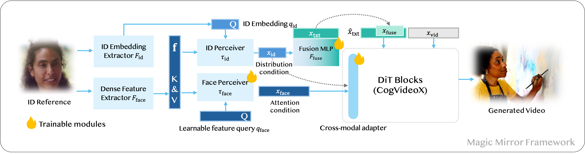

# Magic Mirror: ID-Preserved Video Generation in Video Diffusion Transformers


 

<p align="center">
<a href='https://julianjuaner.github.io/projects/MagicMirror/'></a>
<a href='https://arxiv.org/abs/2312.04302'></a>
</p>

| Reference Image | Generated Video | Generated Video |
| ---- | ---- | ---- |
|  | <video height="240" controls autoplay><source src="assets/teaser_6_1.mp4" type="video/mp4"></video> | <video height="240" controls autoplay><source src="assets/teaser_6_2.mp4" type="video/mp4"></video> |
|  | <video height="240" controls autoplay><source src="assets/teaser_5_1.mp4" type="video/mp4"></video> | <video height="240" controls autoplay><source src="assets/teaser_5_2.mp4" type="video/mp4"></video> |
|  | <video height="240" controls autoplay><source src="assets/teaser_4_1.mp4" type="video/mp4"></video> | <video height="240" controls autoplay><source src="assets/teaser_4_2.mp4" type="video/mp4"></video> |
|  | <video height="240" controls autoplay><source src="assets/teaser_1_1.mp4" type="video/mp4"></video> | <video height="240" controls autoplay><source src="assets/teaser_1_2.mp4" type="video/mp4"></video> |

## Overview

- [Magic Mirror: ID-Preserved Video Generation in Video Diffusion Transformers](#magic-mirror-id-preserved-video-generation-in-video-diffusion-transformers)
  - [Overview](#overview)
  - [MileStones](#milestones)
  - [Methods](#methods)
  - [Cite Magic Mirror](#cite-magic-mirror)

## MileStones

* [X] `20250101` Paper released!
* [ ] `202501-202502` We will release code and model (we are working on fit our methods on CogVideoX-1.5, HunyuanVideo, .etc). Stay tuned!

## Methods


In this work, we presented Magic Mirror, a zero-shot framework for identity-preserved video generation. Magic Mirror incorporates dual facial embeddings and Conditional Adaptive Normalization (CAN) into DiT-based architectures. Our approach enables robust identity preservation and stable training convergence. Extensive experiments demonstrate that Magic Mirror generates high-quality personalized videos while maintaining identity consistency from a single reference image, outperforming existing methods across multiple benchmarks and human evaluations. 

## Cite Magic Mirror

If you find this repo useful for your research, please consider citing the paper

```bibtex
@inproceedings{zhang2025magic,
  title={Magic Mirror: ID-Preserved Video Generation in Video Diffusion Transformers},
  author={Zhang, Yuechen and Yaoyang, Liu and Bin, Xia and Bohao, Peng and Zexin, Yan and Eric, Lo and Jiaya, Jia}
}
```
