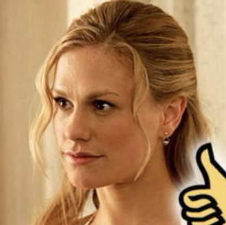

# Magic Mirror: ID-Preserved Video Generation in Video Diffusion Transformers


<p align="center">
 
</p>
<p align="center">
<a href='https://julianjuaner.github.io/projects/MagicMirror/'></a>
<a href='https://arxiv.org/abs/2312.04302'></a>
</p>

# ShowCases
 Please refer to the [project page]('https://julianjuaner.github.io/projects/MagicMirror/') for full-quality and more examples.
## 1. Reference Driven Identity-Aware Text to Video Generation
| Reference Image | Generated Video | Generated Video |
| ---- | ---- | ---- |
|  |  |  |
|  |  |  |
|  |  |  |
|  |  |  |

## 2. Stylized & Special Effect
| Reference Image | Generated Video |  Reference Image  | Generated Video | 
| ---- | ---- | ---- |---- |
||  | |  | 
||  | |  | 
||  | |  | 


## 3. Multi-Shot Generation
A beard man, wearing a yellow T-shirt, working for a wooden table...
  | Reference:<br>|  |  |
| ---- | ---- | ---- |
|  |  |  |

<br>

A woman, wearing a white shirt and blue jeans, enjoying her day-time activities...
  | Reference:<br> |  |  |
| ---- | ---- | ---- |
|  |  |  |


# Overview

- [Magic Mirror: ID-Preserved Video Generation in Video Diffusion Transformers](#magic-mirror-id-preserved-video-generation-in-video-diffusion-transformers)
- [ShowCases](#showcases)
  - [1. Reference Driven Identity-Aware Text to Video Generation](#1-reference-driven-identity-aware-text-to-video-generation)
  - [2. Stylized \& Special Effect](#2-stylized--special-effect)
  - [3. Multi-Shot Generation](#3-multi-shot-generation)
- [Overview](#overview)
- [MileStones](#milestones)
- [Methods](#methods)
- [Cite Magic Mirror](#cite-magic-mirror)

# MileStones

* [X] `20250101` Paper released!
* [ ] `202501-202502` We will release code and model (we are working on fit our methods on CogVideoX-1.5, HunyuanVideo, .etc). Stay tuned!

# Methods


In this work, we presented Magic Mirror, a zero-shot framework for identity-preserved video generation. Magic Mirror incorporates dual facial embeddings and Conditional Adaptive Normalization (CAN) into DiT-based architectures. Our approach enables robust identity preservation and stable training convergence. Extensive experiments demonstrate that Magic Mirror generates high-quality personalized videos while maintaining identity consistency from a single reference image, outperforming existing methods across multiple benchmarks and human evaluations. 

# Cite Magic Mirror

If you find this repo useful for your research, please consider citing the paper

```bibtex
@inproceedings{zhang2025magic,
  title={Magic Mirror: ID-Preserved Video Generation in Video Diffusion Transformers},
  author={Zhang, Yuechen and Yaoyang, Liu and Bin, Xia and Bohao, Peng and Zexin, Yan and Eric, Lo and Jiaya, Jia}
}
```
